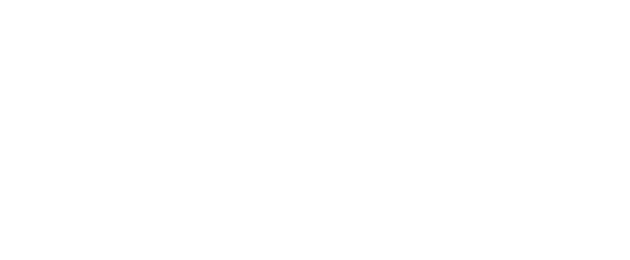

<p align="center">
  
</p>

<p align="center">Personal dotfiles and macOS environment for Aditya Kendre.</p>

<p align="center">
  <video src="https://github.com/user-attachments/assets/3be1b63d-0be1-4f7a-8101-d3b6a09972f9" width="300" controls></video>
</p>

## Quick Start

```bash
curl -sSL https://raw.githubusercontent.com/kendreaditya/.config/main/install.sh | bash
```

Installs Xcode CLT if missing, clones this repo to `~/.config`, then runs `setup-macos.sh`.

## What gets installed

- **Homebrew** formulae + casks (neovim, tmux, ghostty, raycast, zed, etc.)
- **Mac App Store** apps via `mas` (Tailscale)
- **Claude Code CLI**, Oh My Zsh, npm globals, Python venv, vim-plug
- **Fonts** from `assets/fonts/` → `~/Library/Fonts/`
- **macOS defaults** — dock, finder, sidebar, TouchID for sudo
- **Symlinks** — scripts to `~/.local/bin`, Claude config to `~/.claude/`
