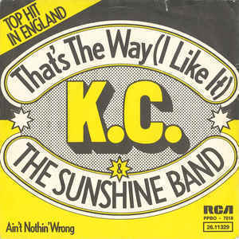

<p align="center">
  
</p>

<p align="center">
  <audio controls>
    <source src="assets/thats-the-way.mp3" type="audio/mpeg" />
  </audio>
  <br/>
  <a href="assets/thats-the-way.mp3">▶ That's The Way (I Like It) — KC & The Sunshine Band</a>
</p>

# .config dotfiles

Personal dotfiles and macOS environment config for Aditya Kendre. Version-controlled and symlinked into the right places on a fresh machine.

## Quick Start (new machine)

```bash
git clone git@github.com:kendreaditya/.config.git ~/.config
~/.config/setup-macos.sh
```

That one script handles everything: Homebrew, packages, casks, Oh My Zsh, Python venv, symlinks, and macOS system defaults.

---

## What's Here

### `setup-macos.sh`
Full macOS setup script. Installs:
- **Homebrew formulae:** imagemagick, ffmpeg, gh, fzf, neovim, tmux, atuin, ripgrep, himalaya, imsg, and more
- **Casks:** Raycast, Zed, Ghostty, Obsidian, Warp, Tailscale, and more
- **Oh My Zsh**, Python venv, PATH symlinks, macOS system defaults

### `scripts/`
Custom CLI tools installed to `~/.local/bin` via symlinks.

| Script | Description | Usage |
|---|---|---|
| `wcb` | Async web scraper → LLM-optimized markdown | `wcb https://docs.example.com` |
| `yt-research` | YouTube channel/search transcripts → markdown | `yt-research @channel_name` |
| `shortn` | Compress markdown to token limit (TextRank) | `shortn input.md -t 8000` |
| `tw-research` | Twitter/X timeline → markdown | `tw-research @username` |
| `url` | Generate HTML redirect files | `url example.com` |

Shared modules: `_utils.py` (venv, progress, markdown), `_context.py` (tokenizer wrappers).

### `claude/`
Claude Code behavioral config — symlinked into `~/.claude/` by `setup-macos.sh`.

| Path | Purpose |
|---|---|
| `claude/CLAUDE.md` | Global Claude instructions |
| `claude/settings.json` | Claude Code preferences |
| `claude/system-prompt.txt` | Global personality/behavior overrides |
| `claude/skills/` | 60 installed agent skills |
| `claude/commands/` | Custom slash commands |
| `claude/agents/` | Role-specific agent personas |

> `claude/docs/` is gitignored — regenerate with `sync-docs`.

### Shell
- `.zshrc` — Oh My Zsh, robbyrussell theme, PATH, aliases
- `ZDOTDIR=$HOME/.config` set in `~/.zshenv` so zsh reads from here

### `requirements.txt`
Python deps for the scripts venv at `~/.config/config-venv/`.

---

## Manual Steps After Setup

After running `setup-macos.sh`, a few things need manual setup:

- **Raycast** — restore settings / extensions
- **AltTab** — configure window switcher preferences
- **Chrome** — sign in, set Perplexity as default search
- **Todoist** — sign in, set Quick Capture shortcut
- **Neovim** — run `:PlugInstall` on first launch
- **Claude Code** — run `sync-docs` to regenerate local docs
